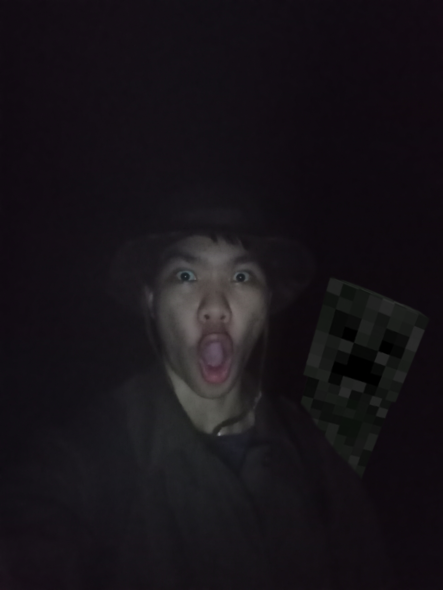

## CM0001 Tham Chiang Dao
### Discovered via: Family's trip
- **First visit:** 2009-2010 idk, I don't remember jack shit about this cave because I was like fucking 4 or 5 or something. All I can think of is that it's well lit since most of section near entrance is a show cave. And I also remember crying at buddha statue inside a cave for some reason.

## TR0007 Tham Morakhot
### Discovered via: Family's trip
- **First visit:** 2013, I was like probably 7 back then, I went with my parent and tour stuff. I'm not sure if it's this cave or not but it's description seems to fit my memory, I remember that we had to go down from boat at sea side and swim into the cave for like 100-200m and will later come out inside an island with small beach and big sign. We had life jacket and ropes, I had my stuff stored in Streamtrail drybag which I still use for caving today even it's been decade, Streamtrail's real tough.

## CM0053 Tham Muang On
### Discovered via: Google map
- **First visit:** 2015-2016 idk, went with family, still a lil kid back then. A tourist trap cave.

## CM0310
### Discovered via: Getting lost while finding Takkatan Cave
- **First visit:** Friday 13th December, 2024. A tiny ass cave with nothing special, I think I spotted some stalactite at the far end, crawl only. Located near Takkatan cave and I though it was a Takkatan cave so I went home.

     
    Entrance view 

- **Second visit:** Wednesday 18th December, 2024. Did the same as last time but took a picture.

     
    Overview of inside passage with a dumbass(me btw) lying on ground thinking he's cool  
     
    Stalactite at the far end — there's a hole below too idk if it goes any further but it's too small.  

## CM0084 Tham Tukatan
### Discovered via: Google map
- **First visit:** Wednesday 18th December, 2024. First actual caving with friends, only made it to bat chamber and some few extends due to having a trash shopee headlamps that lasts like 45 minutes, and friends didn't bring any lights so I had to lend all my shitty back up to them. A hot ass cave with bat shit everywhere or guano if I try to be "professional". Maybe it isn't hot at all idk because I was wearing M65 jacket just to look cool what an idiot. Overall I didn't like to feeling on this cave, its sticky hot and smell bad, air is thick and I felt that my lungs is getting tortured every second by whatever it is in the dust, could be a bacteria or something bad, but other cavers didn't seems to have a trouble so I though I might be overexaggerating. But anyways there's a good amount of flowstone from what I saw.

     
    Entrance view — me n the gng🥀💔  
     
    Overview of entrance chamber  
     
    A group of grasshoppers, hence the name of the cave. Spotted in entrance chamber  
     
    Fungus, near ascending passage.  
     
    Some old flowstone, probably near entrance.  
     
    Huntsman spider, entrance chamber.  
     
    Far end of bat chamber.  
     
    Flowstone formation, bat chamber.  
     
    Creeper, bat chamber.  
     
    Some extended passage from far end of the bat chamber. We called it "Mars"  
     
    Far end of Mars  
     
    Another image of far end of Mars    
    
- **Second visit:** Wednesday 22 January, 2025. Brought an American tourist with me this time, just wanna show her around. Reached bat chamber the same as last time, and I still didn't learn a lesson from last time, M65 + shitty headlamp that lasts 45 mins. We went home after we reached bat chamber. 

     
    Me and Sunnie  

## PK0005 Tham Men
### Discovered via: Google map
- **First visit:** Tuesday, 6th May 2025. We aren't meant to explore this cave though, just happened to stopped by during a beach trip, got in with phone flashlight, beautiful fairly tale ish entrance and inside there's this dark room with a big scary fucking stalactite. For some reason I got scared of it and got tf out.

     
    Entrance view.  
     
    Myon.  
     
    Big ass stalactite.   

## CM0291 Tham Huai Hok
### Discovered via: [Some random YT video](https://youtu.be/pUsOKHSpztI?si=RCGzI9sboowk74_u)
- **First visit:** Monday, 11st August 2025. Took us a while to find this cave because it wasn't pinned on google map so we had to follow a hint from the video(I didn't knew about Martin's site yet back then). This cave? It's so fucking stink from gajillion of bat shits that can be smelled from entrance on and also so fucking hot and bad fucking thick air filled with dirty dust that made me almost quit caving entirely, and I'm damn sure that the experience suck beacause I still wear that M65 jacket just to look cool. But anyways the cave seems to be abit decorated but it seems that who ever tried to make it gave up half way so what left is just some leftover spotlight and wires. The cave is very beautiful and is abundant with calcite formations, there's also a gour poor at far end of cave, you have to follow an electric wire to reach it or just go around while getting cooked alive. We spotted a thousands or gazillion of bats somewhere near gour pool, and there's a slope near entrance which can be pretty dangerous(I fell twice almost badly injured but thanks to knee pads)

     
    Entrance view.  
     
    Somehwhere idk, probably near gour pool section  
     
    Some random corner inside.  
     
    Gour pool section.  
     
    มุกมิก, flowstone idk.  
     
    Big calcite deposite.  
     
    Mick hugging Big dih.  

## CM0062 Tham Wiang Fah
### Discovered via: Martin's website
- **First visit:** Wednesday, 20 August 2025. After CM0291 trip on August 2025, I began to research more on about caving and discovered Martin's site then I fell down a rabbit hole and was thinking about spending more on gears. Today, I didn't go inside, I was just surverying around for the entrance and took a few look, but I did climbed the upper entrance. All I knew is that the place is CMRCA's SRT training ground and other stuff such as climbing etc.

     
    Entrance view.  
     
    Upper entrance stairs.  

- **Second visit:** Wednesday, 3rd September 2025. Showed up again with a new fit, now I finally ditched that old ass M65 jacket and stupid ass cheap chinese light, I came up with Black diamond headlamp, still I should've bought Sofirn instead bruh, my BD are meant for trail running not caving so it ended up getting scracthes. And also I bought a new helmet too, a proper climbing helmet but not caving but it works anyways, whole lot better than a stolen contruction hardhat I used to wear. Anyways we only take a look at entrance chamber and sun chamber, also upper view too. And there's like an army of ladybugs

     
    Freaky Mick — Sun chamber  
     
    Upper view.  
     
    Mick climbing upper entrance.  
     
    Gazillion of ladybugs  

- **Third visit:** Friday, 17th October 2025. Litearlly like last time but with new fit flexing. Found a couple of climbers from Hua Hin too, white dude that speaks Thai so good. I also finally bought Sofirn lights.

     
    Jong trying my Canon EOS300 and the new Sofirn I lended him — Sun chamber  
     
    Me with the new fit — Sun chamber  

## CM0355 Tham Pha Dtaek
### Discovered via: Martin's website
- **First visit:** Wednesday, 20 August 2025. I didn't go inside since I visited this for first time the same day as CM0062. I'm not sure if it's acutally CM0354 or CM0355 but I'll call it CM0355 anyways because it seems to fit the map description, I only peeked at the entrance today. And the pin wasn't precise at all so I got lost and confused abit.
    
     
    Entrance view.  

- **Second visit:** Wednesday, 3rd September 2025. Same day as CM0062's second visit. Same fit. We only made it to assumably Acoustics chamber, again I might be wrong because I wasn't sure if its actually CM0355 or CM0354 because the pin is really closed together and misleading. We spotted a tiny flowstone room near acoustics chamber too, that's require a bit of crawling.

     
    omw down.  
     
    Cumstone inside tiny flowstone chamber.  
     
    Mick's feet, entering tiny flowstone chamber  

## CM0169 Furnace Cave
### Discovered via: Martin's website
- **First visit:** Wednesday, 3rd September 2025. Took us an hour to find this fuckass cave while going back and fourth on fucking trail only to find it at that fucking stream down below, the pin is so so fuckingm misleading, pin is literally on the mountain! Not down below! Anyways we went in unprepared we knew damn well its a wet cave but still we went in with dry cave fit, I had to change my cloth because I'm the only one who dipped into mud water. And also we didn't explore much since the other guy refused to go inside and both me and mick scared of spiders so we screamed and got tf out. I needed a revenge so bad on this fucking cave. We had to climb a 1m hole down though or 50cm idk but it was really hard to climb out.

     
    Entrance view.  
     
    Mick at 1m hole.  
     
    Cave divin with spiders.  
     
    Dumb ahh.  

- **Second visit:** Friday, 17th October 2025. Came back again to take a revenge. This shit is literally a cave diving with so many tight crawls and squeezing, I got some my of stuff snagged and I'm actully still scared of spiders but I tried my best move on and not to scream, and it worked. The cave is still partially flooded, but still possible to continue crawling for a while. We're all soaked full body, had this one section where we had to dive down and drinking up these disgusting water. Also we found some beautiful looking shell, like the one where you would never saw on land. And yeah there's a big ass spider at entrance hole, but good thing is these fucker are slow and doesn't aware of it's surrounding unlike huntmans. Also lesson learned, never bring a fucking waist bag attached to your back. I got stuck and it got snatched off mid way and I also we've lost a map somewhere inside lol, hopefully some random caver will found it eventually. Last note, as of today spiders can be only spotted near entrance, especially the large and scary one.

     
    This is where we were left off(where the red arrow pointed) since it's impossible to continue foward without doing a full dive.  
     
    Me and Jong. Certainly soaked up bad with disgusting water.  
     
    Found footage — Me and Gus.  
     
    The shell I mentioned earlier.  

## To be Continued
 